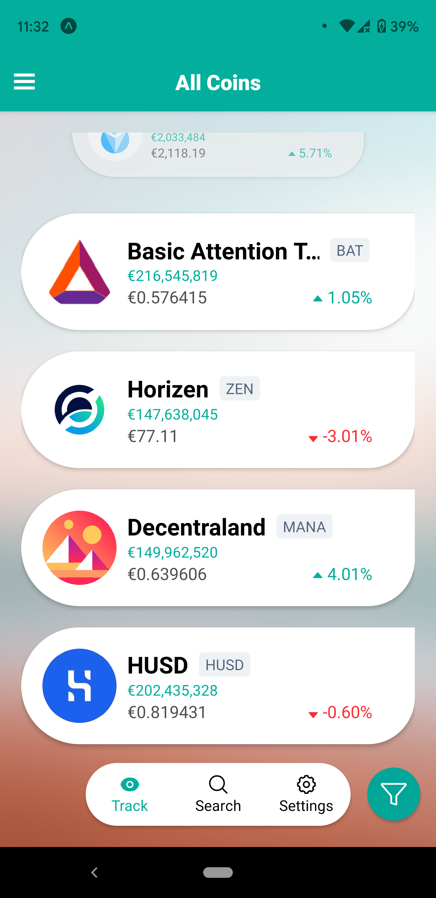
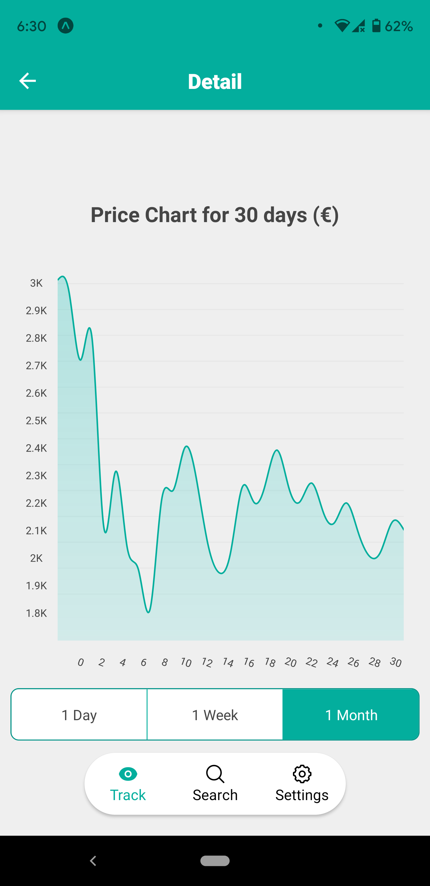
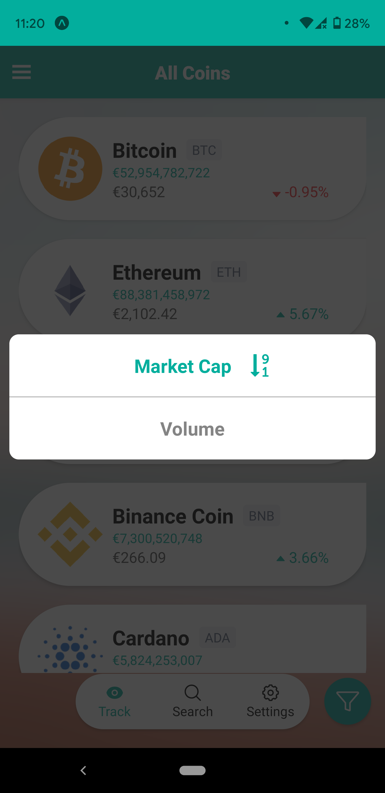
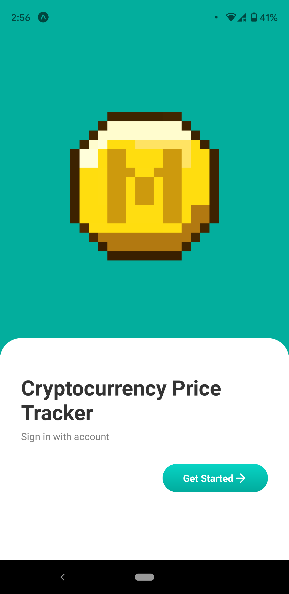
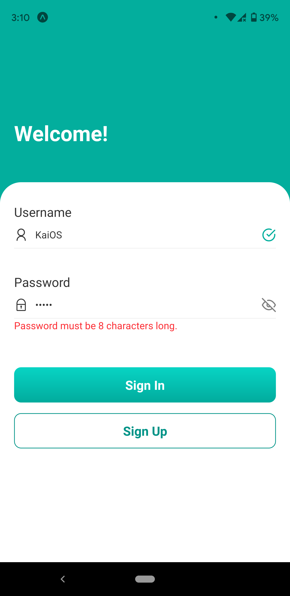
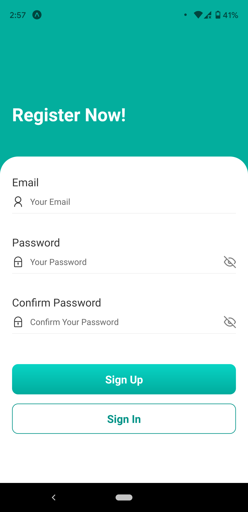
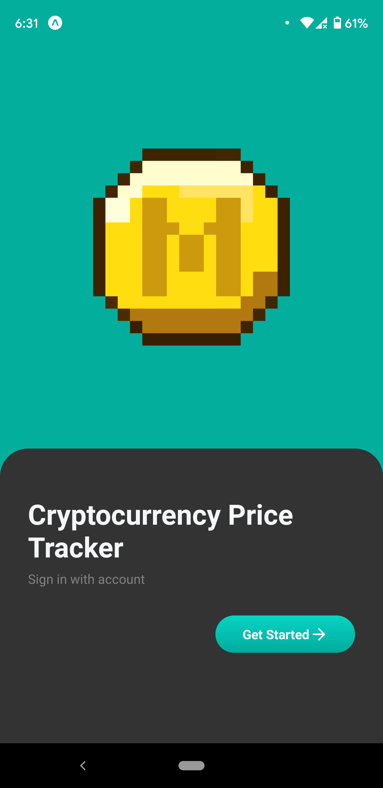

<p align="center">
  
</p>

<div align="center">


[](https://github.com/prettier/prettier)
[](http://makeapullrequest.com)

</div>

# Crypto Tracker App

A Crypto Tracker App inspired by SpiralDev's [**CryptoTracker**], built using React Native, utilizing [CoinGecko API](https://www.coingecko.com/api/documentations/v3) to track the price of cryptocurrencies.

## User Stories

- [ ] The user can request the list of cryptocurrencies from the CoinGecko API and see the results collated together.
- [ ] Progressively load more list items by scrolling down the list.
- [ ] The user can sort the cryptocurrencies based on their `Market Cap` and `Volume`.
- [ ] The application supports theming and can easily be switched between themes.

## App Details

### Screenshots

|                 Prices by Market Cap                 |                    Detail Screen                     |                    Sorted By                     |
| :--------------------------------------------------: | :--------------------------------------------------: | :----------------------------------------------: |
|  |  |  |

### User Registration

|                    Splash Screen                     |                    Sign In                    |                    Sign Up                     |
| :--------------------------------------------------: | :-------------------------------------------: | :--------------------------------------------: |
|  |  |  |

### Dark Theme

|                     Splash Screen                      |                     Sign In                     |                     Detail Screen                      |
| :----------------------------------------------------: | :---------------------------------------------: | :----------------------------------------------------: |
|  |  |  |

### Loading Environment Variables

In the root directory/top-level of your app, create a `.env` file.

```
COINGECKO_URL=https://api.coingecko.com
```
